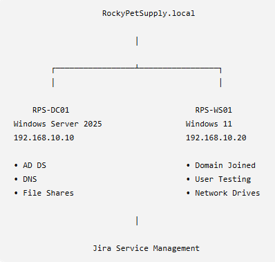

# IT Support Home Lab Architecture

## Network Diagram

## Environment Overview

The lab consists of a Windows Server 2025 Domain Controller and a Windows 11 domain-joined workstation connected through an internal VirtualBox network.

### Components

**RPS-DC01 (Windows Server 2025)**

* Active Directory Domain Services (AD DS)
* DNS Server
* File Shares
* User and Group Management

**RPS-WS01 (Windows 11)**

* Domain Joined Workstation
* End User Testing
* Mapped Network Drives
* DNS Troubleshooting

**Jira Service Management**

* Incident Tracking
* Ticket Documentation
* Resolution Tracking

### Network

Domain:
RockyPetSupply.local

Domain Controller:
RPS-DC01
192.168.10.10

Workstation:
RPS-WS01
192.168.10.20

### Demonstrated Scenarios

* File Share Permission Troubleshooting
* Network Drive Mapping
* DNS Resolution Troubleshooting
* Active Directory Administration
* Help Desk Ticket Management
